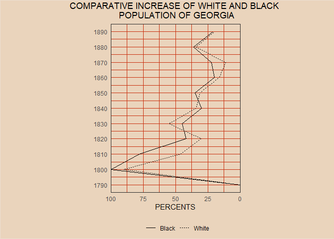
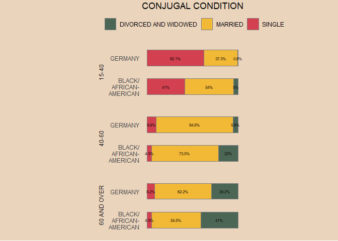
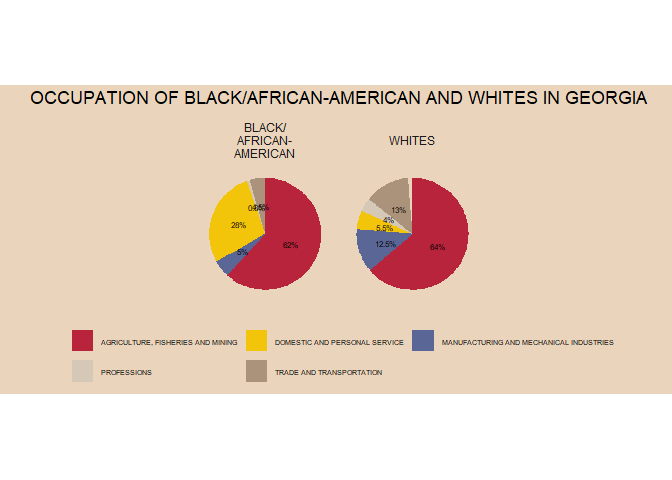
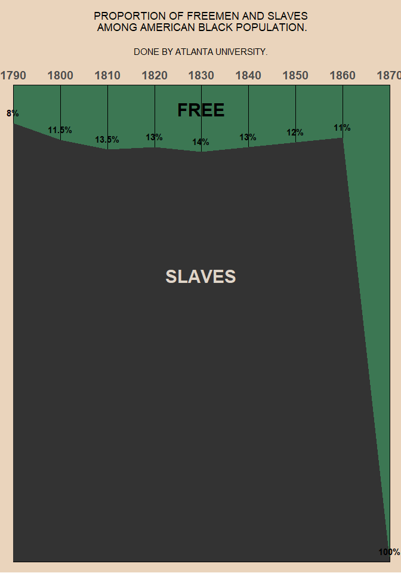
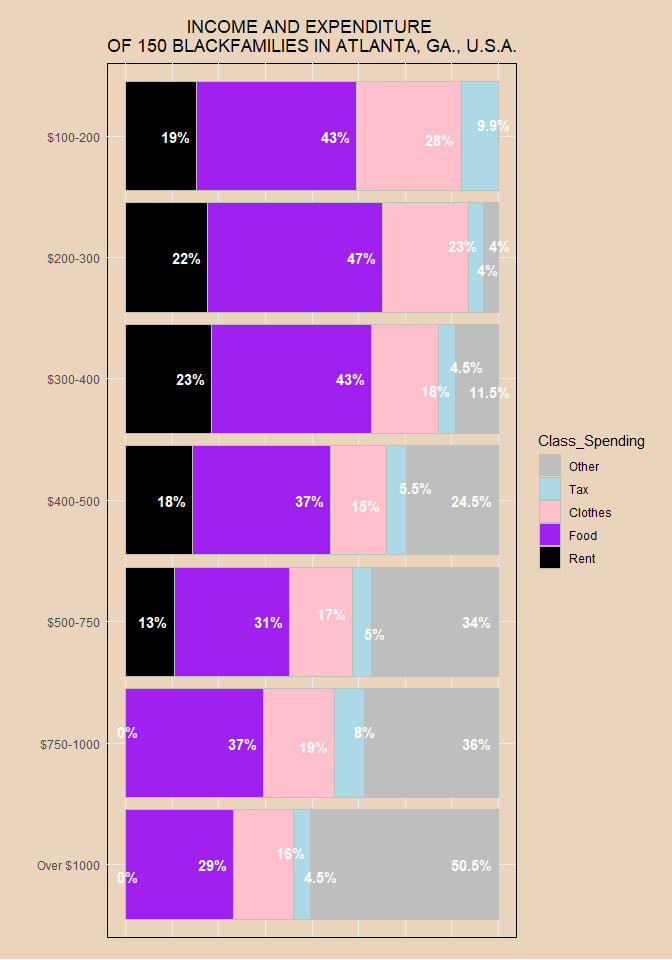

# Tidy Tuesday 

* This RMarkdown file will contain examples of data cleaning and data wrangling using [Tidy Tuesday Datasets](https://github.com/rfordatascience/tidytuesday) and Instructions. 
* The file will be formatted into headers, with the Dates of the Tidy Tuesday and html links to the code stores. 
* The file may not follow Tidyverse nomenclature, and may use other methods- but this is simply for personal development! 


```r
library(tidyverse)
library(dplyr)
library(ggplot2)
library(data.table)
library(readr)
library(scales)
library(ggrepel)
```

# 16/02/2021- [Dubois Challenge](https://github.com/rfordatascience/tidytuesday/tree/master/data/2021/2021-02-16)

## Challenge 01- Comparative Increase of White and Black Population in Georgia

### Initial read in and understanding 


```r
# Get the Data
georgia_pop <- readr::read_csv('https://raw.githubusercontent.com/rfordatascience/tidytuesday/master/data/2021/2021-02-16/georgia_pop.csv')
```

```
## 
## -- Column specification --------------------------------------------------------
## cols(
##   Year = col_double(),
##   Colored = col_double(),
##   White = col_double()
## )
```

```r
head(georgia_pop) # check first 5 columns 
```

```
## # A tibble: 6 x 3
##    Year Colored White
##   <dbl>   <dbl> <dbl>
## 1  1790       0     0
## 2  1800     100    90
## 3  1810      78    46
## 4  1820      42    30
## 5  1830      45    55
## 6  1840      30    34
```

```r
colnames(data) 
```

```
## NULL
```

```r
colnames(georgia_pop)[2] <- "Black" #rename offensive Colored to Black
```

### Plot

```r
# Pivot data so Black and White in a column together 
georgia_pop_gather <- gather(georgia_pop, Black, White, -Year)

colnames(georgia_pop_gather) <- c("Year", "Race", "Percent")

ggplot(data=georgia_pop_gather, aes(x=Year, y=Percent)) + 
  # Set linetype to differ by Race
  geom_line(aes(linetype=Race)) + 
  # Flip the coordinates to plot year on y
  coord_flip() + 
  # set scale to 100
  scale_y_continuous(breaks = seq(0, 100, by=5), limits=c(0,100)) +  
  # Set scale to sit right at end of plot box
  scale_y_reverse(expand=c(0,0)) + 
  # Set scale to 1890
  scale_x_continuous(breaks = seq(1790, 1890, by=10), limits=c(1790,1890)) + 
  # Set title and labels
  ggtitle("COMPARATIVE INCREASE OF WHITE AND BLACK \n POPULATION OF GEORGIA") + 
  xlab(NULL) + ylab("PERCENTS") + 
  theme_minimal() + 
  theme(plot.title = element_text(hjust = 0.5), # center the title
        plot.background = element_rect(fill = '#EAD4BC', colour = '#ECDED1'), # change the plot background colour to beige
        panel.background = element_rect(fill = '#EAD4BC', colour = '#ECDED1')) + # change the whole background colour to beige
  theme(panel.grid.major = element_line("#C93211"), # change plot lines to orange
        panel.grid.minor = element_line("#C93211"), # change plot lines to organge
        panel.border = element_rect(color = "#2B2B2B", fill = NA)) + # set border around the plot
  theme(legend.position="bottom", # move legend to the bottom
        legend.title = element_blank()) +  # remove legend title
  theme(plot.margin = unit(c(0.1,5,0.1,5),"cm")) # set plot margins to ensure fit
```

```
## Scale for 'y' is already present. Adding another scale for 'y', which will
## replace the existing scale.
```

<!-- -->

Comparison to what we were trying to achieve! 


## Challenge 02- Conjugal Condition

### Initial read in and understanding 


```r
# Get the Data
conjugal <- readr::read_csv('https://raw.githubusercontent.com/rfordatascience/tidytuesday/master/data/2021/2021-02-16/conjugal.csv')
```

```
## 
## -- Column specification --------------------------------------------------------
## cols(
##   Population = col_character(),
##   Age = col_character(),
##   Single = col_double(),
##   Married = col_double(),
##   `Divorced and Widowed` = col_double()
## )
```

```r
head(conjugal) # check first 5 columns 
```

```
## # A tibble: 6 x 5
##   Population Age         Single Married `Divorced and Widowed`
##   <chr>      <chr>        <dbl>   <dbl>                  <dbl>
## 1 Germany    15-40         62.1    37.3                    0.6
## 2 Negroes    15-40         41      54                      5  
## 3 Germany    40-60          9.6    84.8                    5.6
## 4 Negroes    40-60          4.5    73.5                   22  
## 5 Germany    60 and over    8.2    62.2                   29.2
## 6 Negroes    60 and over    4.5    54.5                   41
```

```r
colnames(conjugal) 
```

```
## [1] "Population"           "Age"                  "Single"              
## [4] "Married"              "Divorced and Widowed"
```

### Plot

```r
# Pivot data so Black and White in a column together 
conjugal_gather <- gather(conjugal, Single, Married,-Population, -Age)
conjugal_gather
```

```
## # A tibble: 18 x 4
##    Population Age         Single               Married
##    <chr>      <chr>       <chr>                  <dbl>
##  1 Germany    15-40       Single                  62.1
##  2 Negroes    15-40       Single                  41  
##  3 Germany    40-60       Single                   9.6
##  4 Negroes    40-60       Single                   4.5
##  5 Germany    60 and over Single                   8.2
##  6 Negroes    60 and over Single                   4.5
##  7 Germany    15-40       Married                 37.3
##  8 Negroes    15-40       Married                 54  
##  9 Germany    40-60       Married                 84.8
## 10 Negroes    40-60       Married                 73.5
## 11 Germany    60 and over Married                 62.2
## 12 Negroes    60 and over Married                 54.5
## 13 Germany    15-40       Divorced and Widowed     0.6
## 14 Negroes    15-40       Divorced and Widowed     5  
## 15 Germany    40-60       Divorced and Widowed     5.6
## 16 Negroes    40-60       Divorced and Widowed    22  
## 17 Germany    60 and over Divorced and Widowed    29.2
## 18 Negroes    60 and over Divorced and Widowed    41
```

```r
colnames(conjugal_gather) <- c("Population", "Age", "Condition", "Percent")
conjugal_gather$Condition <- toupper(conjugal_gather$Condition)
conjugal_gather$Population <- toupper(conjugal_gather$Population)
conjugal_gather$Population[conjugal_gather$Population=="NEGROES"] <- "BLACK/\nAFRICAN-\nAMERICAN"
conjugal_gather$Age <- toupper(conjugal_gather$Age)
pal <- c("#4C6655", "#F2B937", "#D34150") # set colours 

# To do this just remove, position=dodge from the geom_bar argument
ggplot(data =conjugal_gather, 
       # Set x to Percentage, y to Population and fill using Condition of Relationship
       aes(x = Percent, y = Population, fill = Condition, color=Condition)) + 
  # Use filled bars, with a border of grey around them
    geom_bar(position="fill", stat = 'identity', width = 0.55, color = "grey50", size = 0.2) +
  # Set title, x label and y label 
  ggtitle("CONJUGAL CONDITION") + ylab(NULL) + xlab(NULL)+ 
  # facet the graph on the age, using just one column, switch=both moves facet to other axis
  facet_wrap(vars(Age), ncol=1, switch="both") + 
  # Set the percentages to show in the centre of each condition box, at size of 2
  geom_text(aes(y = Population, x = Percent, label = paste0(Percent, "%")), size = 2, color="black",position = position_fill(vjust = 0.5)) + 
  # Set the colours to the pal to enable similarity to original
  scale_fill_manual(values = pal) +
  # Set theme to minimal
  theme_minimal() + 
  theme(plot.title = element_text(hjust = 0.5), # center the title
        plot.background = element_rect(fill = '#EAD4BC', colour = NA), # change the plot background colour to beige
        panel.background = element_rect(fill = '#EAD4BC', colour = NA)) + # change the whole background colour to beige
  theme(panel.grid.major = element_line(NA), # change plot lines to orange
        panel.grid.minor = element_line(NA), # change plot lines to organge
        panel.border = element_rect(color = NA, fill = NA)) + # set border around the plot
  theme(legend.position="top", # move legend to the bottom
        legend.title = element_blank()) +  # remove legend title
  theme(plot.margin = unit(c(0.1,5,0.1,5),"cm")) + # set plot margins to ensure fit 
  theme(axis.text.x=element_blank()) + # turn off the x axis
  theme(strip.placement="outside") # reposition facets to outside of population labels
```

```
## Warning: 'switch' is deprecated.
## Use 'strip.position' instead.
## See help("Deprecated")
```

<!-- -->

Comparison to what we were trying to achieve! 


## Challenge 03- Occupations of Black/ African-American and Whites in Georgia

### Initial read in and understanding 


```r
# Get the Data
occupation <- readr::read_csv('https://raw.githubusercontent.com/rfordatascience/tidytuesday/master/data/2021/2021-02-16/occupation.csv')
```

```
## 
## -- Column specification --------------------------------------------------------
## cols(
##   Group = col_character(),
##   Occupation = col_character(),
##   Percentage = col_double()
## )
```

```r
head(occupation) # check first 5 columns 
```

```
## # A tibble: 6 x 3
##   Group   Occupation                              Percentage
##   <chr>   <chr>                                        <dbl>
## 1 Negroes Agriculture, Fisheries and Mining             62  
## 2 Negroes Manufacturing and Mechanical Industries        5  
## 3 Negroes Domestic and Personal Service                 28  
## 4 Negroes Professions                                    0.8
## 5 Negroes Trade and Transportation                       4.5
## 6 Whites  Agriculture, Fisheries and Mining             64
```

```r
colnames(occupation) 
```

```
## [1] "Group"      "Occupation" "Percentage"
```
### Plot

* Cannot work out how to do the Pie Chart in the same way as original, but never done pie charts in ggplot anyway- so gave them a go!

```r
occupation$Group <- toupper(occupation$Group)
occupation$Occupation <- toupper(occupation$Occupation)
occupation$Group[occupation$Group=="NEGROES"] <- "BLACK/\nAFRICAN-\nAMERICAN"
pal <- c("#b8243c", "#f2c50a", "#5a6796", "#d5c8b7", "#ab927a") # set colours 

ggplot(data =occupation, 
       # Set x to Percentage, y to Population and fill using Condition of Relationship
       aes(x ="", y = Percentage, fill = Occupation, group=Group)) + 
  # Use filled bars, with a border of grey around them
    geom_bar(stat = 'identity', width = 1) +
    coord_polar("y", start=0) +
  # Set title, x label and y label 
  ggtitle("OCCUPATION OF BLACK/AFRICAN-AMERICAN AND WHITES IN GEORGIA") + ylab(NULL) + xlab(NULL) + 
  
  # Set the percentages to show in the centre of each occupation pie section, at size of 2
  geom_text(aes(label = paste0(Percentage, "%")), size = 2, color="black",position = position_stack(vjust = 0.5)) + facet_wrap(~Group) +
  # Set the colours to the pal to enable similarity to original
  scale_fill_manual(values = pal) +
  # Set theme to minimal
  theme_minimal() + 
  theme(plot.title = element_text(hjust = 0.5), # center the title
        plot.background = element_rect(fill = '#EAD4BC', colour = NA), # change the plot background colour to beige
        panel.background = element_rect(fill = '#EAD4BC', colour = NA)) + # change the whole background colour to beige
  theme(panel.grid.major = element_line(NA), # change plot lines to NA
        panel.grid.minor = element_line(NA), # change plot lines to NA
        panel.border = element_rect(color = NA, fill = NA)) + # set border around the plot
  theme(legend.position="bottom", # move legend to the bottom
        legend.title = element_blank(), # remove legend title
        legend.text = element_text(size=5.5)) +  
  theme(plot.margin = unit(c(0.1,5,0.1,5),"cm")) + # set plot margins to ensure fit 
  guides(fill=guide_legend(nrow=2, byrow=TRUE)) + # legend in two rows
  theme(axis.text.x=element_blank()) + # turn off the x axis
  theme(strip.placement="outside") # reposition facets to outside of population labels
```

<!-- -->

Comparison to what we were trying to achieve! 


## Challenge 04- Proportion of Freeman and Slaves Among American Black Population

### Initial read in and understanding 


```r
# Get the Data
freed <- readr::read_csv('https://raw.githubusercontent.com/rfordatascience/tidytuesday/master/data/2021/2021-02-16/freed_slaves.csv')
```

```
## 
## -- Column specification --------------------------------------------------------
## cols(
##   Year = col_double(),
##   Slave = col_double(),
##   Free = col_double()
## )
```

```r
head(freed) # check first 5 columns 
```

```
## # A tibble: 6 x 3
##    Year Slave  Free
##   <dbl> <dbl> <dbl>
## 1  1790  92     8  
## 2  1800  88    11  
## 3  1810  86.5  13.5
## 4  1820  87    13  
## 5  1830  86    14  
## 6  1840  87    13
```

```r
colnames(freed) 
```

```
## [1] "Year"  "Slave" "Free"
```

### Plot


```r
# sort data not adding to 100 always 
freed$sum <- freed$Slave + freed$Free
# 1800 adds to 99%? 
freed$Slave[2] <- freed$Slave[2] + 0.5 
freed$Free[2] <- freed$Free[2] + 0.5
freed <- subset(freed, select=c(Year, Slave, Free))

ggplot(data=freed, 
       # Set Y to Slave, x to Year)
       aes(x=Year, y=Slave)) + 
  # Use geom_area for this 
  geom_area() + 
  # set x and y limits 
  scale_y_continuous(limits=c(0,100), expand=c(0,0)) + 
  scale_x_continuous(limits=c(NA,NA), n.breaks=9, expand=c(0,0), position="top")+ 
  coord_cartesian(clip="off") +
  labs(
    title = "PROPORTION OF FREEMEN AND SLAVES\n AMONG AMERICAN BLACK POPULATION.",
    subtitle = "\nDONE BY ATLANTA UNIVERSITY.\n"
  ) + 
  # Adding annotation to the plot 
  geom_text(aes(Year, Slave, label= paste0(100-Slave, "%")), vjust=-1, size=4, fontface="bold") +
  # add labels 
  annotate("text", x=1830, y=95, label= "FREE", size=8, color="black", fontface="bold") +
  annotate("text", x=1830, y=60, label="SLAVES", size=8, color="#e0d5c8", fontface="bold") +
  # Set the colours to the pal to enable similarity to original
  scale_fill_manual(values = c("Dark Green", "Black")) +
  # Set theme to minimal
  theme_minimal() + 
  theme(plot.title = element_text(hjust = 0.5), # center the title
        plot.subtitle = element_text(hjust=0.5), #center the subtitle
        plot.background = element_rect(fill = '#EAD4BC', colour = NA), # change the plot background colour to beige
        panel.background = element_rect(fill = '#3c7753')) + # change the whole background colour to beige
  theme(panel.grid.major.x = element_line("black"), # change plot lines to NA
        panel.grid.major.y = element_line(NA),
        panel.grid.minor = element_line(NA)) + 
  theme(legend.position="none", # remove legend
        legend.title = element_blank(), # remove legend title
        legend.text = element_text(size=5.5)) +  
  theme(plot.margin = unit(c(0.5,0.5,0.5,0.5),"cm"), # set plot margins to ensure fit 
        axis.text.y = element_blank(), axis.title.y = element_blank(), axis.title.x= element_blank(), axis.text.x.top=element_text(vjust=1, size=14, face="bold")) # turn off axis y and axis y and x labels
```

<!-- -->

Comparison to what we were trying to achieve! 


## Challenge 05- Income and Expenditure of 150 Black Families in Atlanta, GA, USA

### Initial read in and understanding 


```r
# Get the Data
income <- readr::read_csv('https://raw.githubusercontent.com/rfordatascience/tidytuesday/master/data/2021/2021-02-16/income.csv')
```

```
## 
## -- Column specification --------------------------------------------------------
## cols(
##   Class = col_character(),
##   `Actual Average` = col_double(),
##   Rent = col_double(),
##   Food = col_double(),
##   Clothes = col_double(),
##   Tax = col_double(),
##   Other = col_double()
## )
```

```
## Warning: 1 parsing failure.
## row col  expected    actual                                                                                                   file
##   1  -- 7 columns 6 columns 'https://raw.githubusercontent.com/rfordatascience/tidytuesday/master/data/2021/2021-02-16/income.csv'
```

```r
head(income) # check first 5 columns 
```

```
## # A tibble: 6 x 7
##   Class     `Actual Average`  Rent  Food Clothes   Tax Other
##   <chr>                <dbl> <dbl> <dbl>   <dbl> <dbl> <dbl>
## 1 $100-200              139.    19    43      28   9.9  NA  
## 2 $200-300              249.    22    47      23   4     4  
## 3 $300-400              336.    23    43      18   4.5  11.5
## 4 $400-500              434.    18    37      15   5.5  24.5
## 5 $500-750              547     13    31      17   5    34  
## 6 $750-1000             880      0    37      19   8    36
```

```r
colnames(income) 
```

```
## [1] "Class"          "Actual Average" "Rent"           "Food"          
## [5] "Clothes"        "Tax"            "Other"
```

### Plot


```r
income_gather <- gather(income, key="Class_Spending", value="Percent", -Class, -"Actual Average")

income_gather$Class <- fct_relevel(income_gather$Class, "Over $1000", "$750-1000", "$500-750", "$400-500", "$300-400", "$200-300", "$100-200")
income_gather$Class_Spending <- fct_relevel(income_gather$Class_Spending, "Other", "Tax", "Clothes", "Food", "Rent")

# Create cumulative value for each Class to enable lines between
income_gather <- income_gather %>% group_by(Class) %>% mutate(Cumulative_Income=cumsum(Percent)) %>% ungroup()

ggplot(data =income_gather, 
       # Set x to Percentage, y to Class and fill using Class_Spending
       aes(x = Percent, y = Class, fill = Class_Spending, color=Class_Spending)) + 
  # Use filled bars, with a border of grey around them
    geom_bar(position="fill", stat = 'identity', color="grey") + 
  # Labels 
  labs(title="INCOME AND EXPENDITURE \nOF 150 BLACKFAMILIES IN ATLANTA, GA., U.S.A.", x="", y="") +
  # Set axis to 100%
  scale_fill_manual(values=c("grey", "lightblue", "pink", "purple", "black")) +
  scale_x_continuous(labels=scales::percent_format(scale=100)) +
 geom_text_repel(aes((Percent/100), Class, label= paste0((Percent), "%")), position="stack", size=4, fontface="bold", color="white", vjust=0.5, hjust=0, box.padding=unit(0.3, "lines")) +
  # Set theme to minimal
  theme_minimal() + 
  theme(plot.title = element_text(hjust = 0.5), # center the title
        plot.subtitle = element_text(hjust=0.5), #center the subtitle
        plot.background = element_rect(fill = '#EAD4BC', colour = NA), # change the plot background colour to beige
        panel.background = element_rect(fill = '#EAD4BC')) + # change the whole background colour to beige
  #theme(panel.grid.major.x = element_line("black"), # change plot lines to NA
  #      panel.grid.major.y = element_line(NA),
  #      panel.grid.minor = element_line(NA)) + 
  #theme(legend.position="none", # remove legend
  #      legend.title = element_blank(), # remove legend title
  #      legend.text = element_text(size=5.5)) +  
  theme(plot.margin = unit(c(0.5,0.5,0.5,0.5),"cm"), # set plot margins to ensure fit 
        axis.text.x=element_blank(), axis.title.x= element_blank(), axis.text.x.top=element_text(vjust=1, size=14, face="bold")) # turn off axis y and axis y and x labels
```

```
## Warning: Removed 1 rows containing missing values (position_stack).

## Warning: Removed 1 rows containing missing values (position_stack).
```

<!-- -->

Comparison to what we were trying to achieve! 


